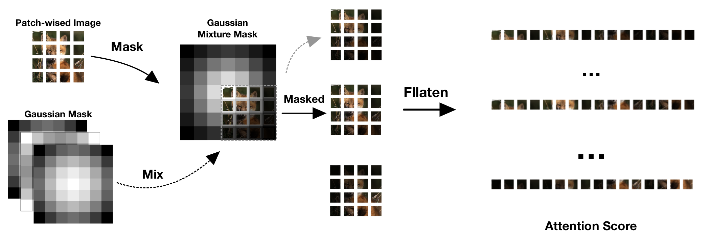
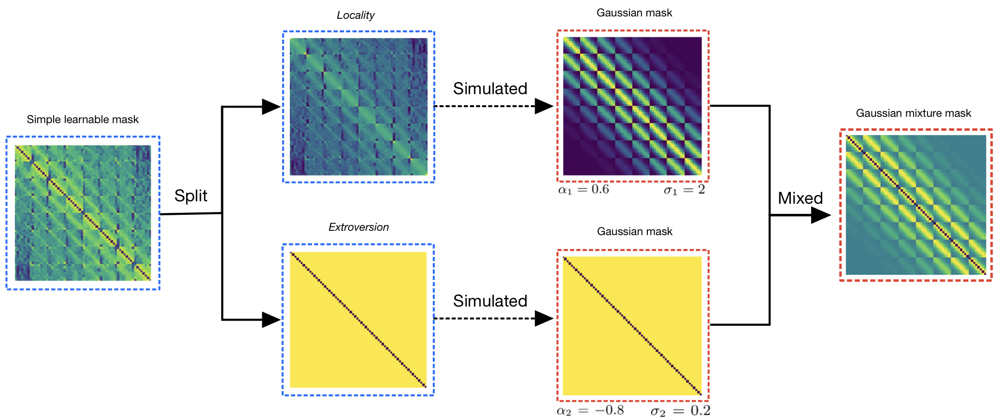

# RetNet Viewed through Convolution

**Paper:** [Read the Full Paper (PDF)](https://arxiv.org/pdf/2309.05375.pdf)

**Authors:** Chenghao Li, Chaoning Zhang


## Environment

The environment configuration file has already been provided, and you can use the following script to create the required environment.

```bash
pip install -r requirements.txt
```


## Intro

The success of Vision Transformer (ViT) in image recognition tasks has been well-documented. While ViT can capture global dependencies better than Convolutional Neural Networks (CNN), CNN's local characteristics are still valuable due to their resource efficiency. Recently, [RetNet](https://arxiv.org/abs/2307.08621) has demonstrated remarkable performance in language modeling, outperforming Transformers with explicit local modeling. This has led researchers to explore Transformers in the Computer Vision (CV) field.

[This paper](https://arxiv.org/pdf/2309.05375.pdf) investigates the applicability of RetNet from a CNN perspective and introduces a customized RetNet variant for visual tasks. Similar to RetNet, we enhance ViT's local modeling by introducing a weight mask to the self-attention matrix. Our initial results with a learnable element-wise weight mask (ELM) show promise. However, ELM introduces additional parameters and optimization complexity.

To address this, our work proposes a novel Gaussian mixture mask (GMM) with only two learnable parameters, making it suitable for various ViT variants with adaptable attention mechanisms. Experiments on multiple small datasets illustrate the effectiveness of our Gaussian mask in enhancing ViTs at minimal additional cost in terms of parameters and computation.

## Approach


**Element-wise Conv Operation.** If the mask is a circulant matrix with multi-diagonal properties, when such a matrix is added to the attention scores using the Hadamard product, it can be perceived as performing an operation akin to an element-wise convolution. The *convolution kernel* is the hidden feature vector, while the *feature map* is the weight mask. Examples of 1D and 2D cases are shown above.


**Gaussian Mixture Mask (GMM) Attention** From the perspective of CNN, by explicitly modeling and discovering two features of ViT using masks, we introduce the Gaussian Mixture Mask (GMM). We simply add the obtained GMM to the preceding softmax operation and validate it through experiments. Adding it before and after the softmax does not significantly affect the results. To maintain a structure similar to the original paper, we treat this operation as a straightforward masking operation to achieve the Gaussian mixture attention mechanism. 




Building upon these insights, Gaussian Mixture Mask outperforms the Element-wise Learnable Mask significantly and minimizes the additional parameter and computation overhead to almost zero.

## Outcomes

| Model      | CIFAR-10  | CIFAR-100 | SVHN     | Tiny-ImageNet | Parameters | MACs     | Depth |
|------------|-----------|-----------|----------|---------------|------------|----------|-------|
| ViT        | 93.65%    | 75.36%    | 97.93%   | 59.89%        | 2.7M       | 170.9M   | 9     |
| GMM-ViT    | **95.06%**| **77.81%**| **98.01%** | **62.27%**   | 2.7M       | 170.9M   | 9     |
| Swin       | 95.26%    | 77.88%    | 97.89%   | 60.45%        | 7.1M       | 236.9M   | 12    |
| GMM-Swin   | **95.39%**| **78.26%**| **97.90%** | **61.03%**   | 7.1M       | 236.9M   | 12    |
| CaiT       | 94.79%    | 78.42%    | 98.13%   | 62.46%        | 5.1M       | 305.9M   | 26    |
| GMM-CaiT   | **95.15%**| **78.97%**| 98.09%   | **63.64%**    | 5.1M       | 305.9M   | 26    |
| PiT        | 93.68%    | 72.82%    | 97.78%   | 57.63%        | 7.0M       | 239.1M   | 12    |
| GMM-PiT    | **94.41%**| **74.16%**| **97.82%** | **58.37%**   | 7.0M       | 239.1M   | 12    |
| T2T        | 95.32%    | 78.10%    | 97.99%   | 61.50%        | 6.5M       | 417.4M   | 13    |
| GMM-T2T    | **96.16%**| **79.91%**| 97.98%   | **63.33%**    | 6.5M       | 417.4M   | 13    |

## Run scripts

The following simple commands can be used to run experiments on your machine.

**Quick Start**

```bash
python main.py
```

**Original model**

```bash
python main.py --model [model_name]
```

**GMM variants**

```bash
python main.py --model [model_name] --is_GMM
```

## Acknowledgements

We would like to express our great appreciation to the code authors of the [pytorch-image-models](https://github.com/huggingface/pytorch-image-models) and [Vision Transformer for Small-Size Datasets](https://github.com/aanna0701/SPT_LSA_ViT) repositories, for their great help to the machine learning community.

